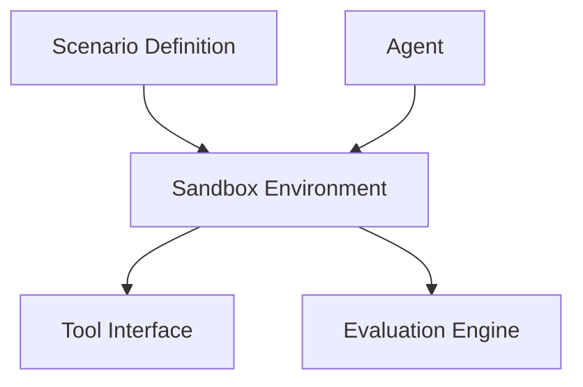

# AgentSandbox


AgentSandbox is a simulation environment for testing autonomous agents.

It allows developers to plug an agent into a sandbox and run it through controlled scenarios to evaluate behavior, reliability, and goal completion.

## Why this exists

As more systems embed autonomous agents, it becomes critical to verify that agents behave correctly before deploying them in production.

Traditional testing tools are not designed for systems that:

- reason dynamically
- interact with tools
- operate in open-ended environments
- make decisions autonomously

AgentSandbox provides a safe environment where agents can be evaluated against structured scenarios.

## Quick Start

```bash
git clone https://github.com/joshuamlamerton/agentsandbox
cd agentsandbox
python examples/demo.py
```

## Demo

The demo shows:

- a sandbox environment
- an agent attempting to complete a task
- scenario rules
- evaluation results

## Architecture



## Repository Structure

```
agentsandbox

README.md
LICENSE

docs
  architecture.md

core
  agent_interface.py
  sandbox.py
  scenario.py
  evaluator.py

examples
  demo.py

tests
  test_basic.py
```

## Roadmap

Phase 1  
Basic sandbox and scenarios

Phase 2  
Tool interaction simulation

Phase 3  
Agent scoring and metrics

Phase 4  
Agent competitions and benchmarking

## License

Apache 2.0
